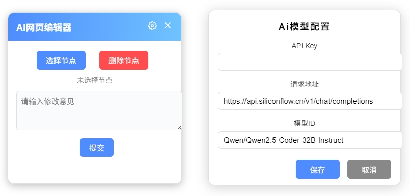

AI 网页编辑器

这是一个可以通过选中页面 DOM 元素，并根据用户提供的提示词，利用 AI 能力修改页面的工具。

主要功能：
- 选中页面上的任意 DOM 元素。
- 输入自然语言提示词，描述你想要进行的修改。
- AI 理解提示词并尝试对选中的元素应用修改。

这个项目旨在简化网页的编辑和开发过程，即使不熟悉代码的用户也能通过简单的交互实现页面修改，为快速原型开发或内容调整提供便利。

使用教程-打开谷歌浏览器-设置-扩展程序-开发者模式-加载已解压的扩展程序-选择当前项目

软件截图

English description

AI Web Editor

This is a tool that allows you to modify web pages using AI capabilities by selecting page DOM elements and providing user prompts.

Main Features:
- Select any DOM element on the page.
- Enter natural language prompts describing the modifications you want to make.
- AI understands the prompt and attempts to apply the modifications to the selected element.

This project aims to simplify the process of web page editing and development, allowing even users unfamiliar with code to modify pages through simple interaction, providing convenience for rapid prototyping or content adjustment.

Screenshot

